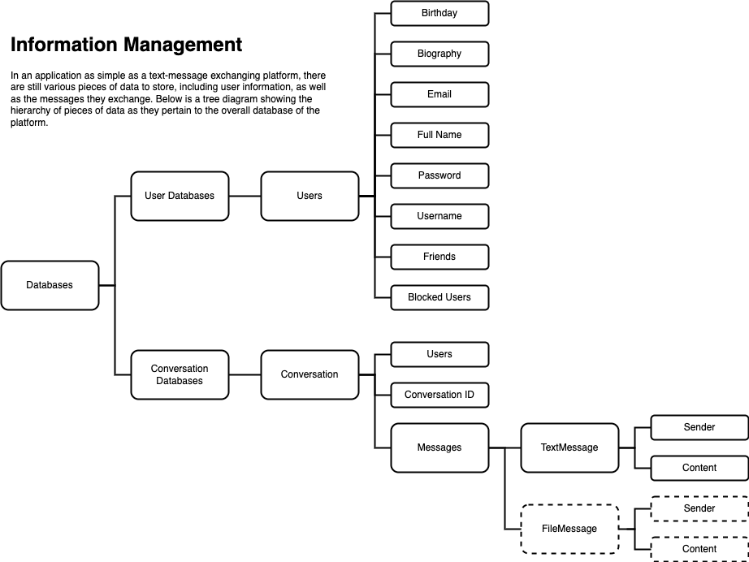

# CS 1800 Team Project: Social Media Platform

## Table of Contents
- Project Structure and Implementation
    - Project Structure
        - Data Storage
        - Server Client Interaction
        - User Interface (COMING SOON)
    - Implementation
        - Data Storage
            - ActionNotAllowedException.java
            - User.java
            - Message.java
                - TextMessage.java
            - Conversation.java
            - Database.java
                - ConversationDatabase.java
                - UserDatabase.java
        - Sever Client Interaction
            - ServerClass.java
            - ClientClass.java
        - User Interface (COMING SOON)
- Compiling and Testing
    - Compiling
    - Testing
        - TestsMessageAndConversationClass.java
        - TestsUserClass.java
        - TestsUserDatabase.java
- Submissions
## Project Structure and Implementation
### Project Structure
#### Data Storage
Presented with the choice of developing a social media platform with either the capability to post images and texts, or send text messages, our team chose to develop one that was able to send text messages and initiate group chats. Making this decision, we were able to begin planning out the structure of our application. Below is shown a simple hierarchical chart of how we planned to manage data in our application. Most importantly, we would be storing data in two kinds of databases, one for users, and one for conversations, both storing objects of identical name utilizing Java's ObjectInputStream and file writing capabilities to avoid data loss in the alternative, which was storing data utilizing BufferedWriter and BufferedReader, which would be subject to errors in string concatenation, NumberFormatException(s), string reading, etc. In the bottom right corner there is also a cell with associated fields named "FileMessage," which indicates the possibility of our application being able to be upgraded to include image text messaging. As there is a singular Message superclass implemented currently, different kinds of message subclasses that represent different things can be added with little issue in the application, due to the aforementioned object storage method we utilize.

#### Server and Client
With data handling capabilities implemented, we now turned our attention to being able to handle multiple users at once. At its core, the proposed structure of our implementation is incredibly simple, requiring the client to first "log in," letting the server know the identity of the client, and then when the client sends a request of a certain type, the server will associate the request with the user and process the request, returning the correct information to the client.

Finally, we plan to implement this feature into our application utilizing the data handling capabilities that were created and tested in Phase 1. For example, if a user chooses to send a message in a conversation, we'll utilize the addMessage method written in the Conversation class.
### Implementation
#### Data Storage
##### ActionNotAllowedException.java
This class represents the exception that is thrown when a User performs an illegal action.   
This exception may be thrown when the User's chosen username contains a space, or when the User attempts to add or   
block another user whom they have already added or blocked, respectively. It could also be thrown when a Message's index  
is out of bounds.

##### User.java
This class contains the information for each individual user.   
Each user has a name, username, password, bio, and birthday. Each user has a list of friends,   
which they can add or remove other users from, as well as a list of blocked users.  
Blocked users will not be able to have conversations with each other.  
Along with password creation, we decided to incorporate password encryption into the User class. This will ensure a   
safer and more secure experience for Users.

##### Message.java
This class represents a Message that a User sends. Each message has a time at which it was sent, the User who sent it,  
and a message index (which denotes the order in the conversation that this Message was sent).

###### TextMessage.java
This subclass extending the Message superclass represents a text sent between Users. Its functionality includes editing/changing Text Messages, and comparing two messages to check their equality. Finally, this class has a toString functionality which displays the User who sent   
the message, the time the message was sent, and the content of the message.

##### Conversation.java
This class contains the information for every conversation in the database. Each conversation has a Conversation Name,   
which consists of the names of the Users involved in the conversation separated by an underscore, and a unique   
conversationID. The unique conversationID will make it much easier to store and find the conversations in the database.

##### Database.java

###### ConversationDatabase.java
The conversation database stores every message that has ever been sent by any of the Users. The database can return  
which conversations the User is involved in, as well as write all the conversation names to a file. Also, given a   
conversation name, the database can retrieve all messages from that conversation. This will be helpful for implementing  
a search option.

###### UserDatabase.java
This class contains the methods to read and write all the User objects from a specific file. It also has the  
retrieveUserData method which looks for a specific user object in the specific file (the file path is a field).

#### Server Client Interaction
##### ServerClass.java
Includes three key fields: userArray, userData, convos, of the ArrayList<User>, UserDatabase, ConversationDatabase classes

##### ClientClass.java

## Compiling and Testing
### Compiling
To compile the various files of this application, it's recommended that the entire project be downloaded off of Github or
Vocareum, depending on who you are, and opened in IntelliJ. To fastest way to compile all the files in the project is to use the keyboard shortcut "Ctrl + R" on Windows or "Cmd + R" on Mac, in order to Run an arbitrary class file in the project, automatically compiling all other files.
### Testing

## Submissions
### Phase 1
- Vocareum: Ellie Williams
#### Phase 2
- Vocareum: Ellie Williams

#### Testing User.java

In order to test the User class and its various methods, several test cases were created. Firstly, the User constructor itself was tested to ensure that the getters/setters were returning expected values. The add/block/remove user  
methods were tested in both successful and unsuccessful cases (namely, when an exception was or was not thrown).   
We also tested the method which compared two Users alphabetically by their first names, with several different scenarios.  
Finally, the encrypt method for passwords was tested by comparing the program's output with the expected output.

#### Testing TextMessage.java and Message.java

There are two main tests written in UserTests.java for Message.java methods. The first one is a constructor method and  
it simply checks, using the getter methods, that the fields in the newly created Message object  
are equivalent to what they're expected to be. The second test, tests if an index setter method does  
what it's expected to do. In our implementation, adding (sending) a message in a conversation  
requires it's associated method to change the  
message index of the new message to the size of the message ArrayList, so it's crucial  
that this method functions.

There are several tests for TextMessage.java. The first one test the constructor in an identical way to how  
Message.java's constructor is tested. The second one tests the edit message method in the subclass,  
by comparing the final rawMessage field of a TextMessage object to what it's expected to be. The third checks  
our equality method using a simple assertTrue method call. The final test tests our toString method, which converts  
the Message object into a string for file writing.

#### Testing ConversationDatabase.java and Conversation.java

Because the Conversation.java constructor inherently relies on the ConversationDatabase constructor,  
one encompassing test was written in order to test both. This test just compares the expected  
size of the fields, as well as their values. To check the available conversation  
method, an empty file was created and read through, and an assertEqual method call was used to check  
that the expected size of the returned ArrayList was what equal to what it was actually. The next two   
methods test the addUser and removeUser methods, and they both use assertEquals methods  
to check that the size of the user ArrayLists are what they are expected to be after the methods  
have been called. The addMessage and deleteMessage accomplish this in the exact same way, using the assertEquals  
method call.

#### Testing UserDatabase.java

The UserDatabase writes and reads data from the same files. Therefore, to test it, we first wrote test data to the  
database. We then read that same data from the database and compared it to the input we put for the writeDatabase  
method. Finally, we chose a random user from our example data and tested to see if the retrieveUserData method would  
find the user from the database. All tests passed.